## 水印检测

## 引言

&nbsp;&nbsp;&nbsp;&nbsp;&nbsp;&nbsp;&nbsp;&nbsp;进行水印检测的必要性在于保护数字内容的所有权和防止非法传播. 在当今信息化时代, 数字内容的快速传播与复制使得保护创作者的知识产权变得尤为重要. 通过检测水印，可以有效验证内容的来源和合法性, 避免因未经授权的使用造成的商业损失或法律纠纷. 此外, 在某些场景下，例如敏感信息的泄露调查, 水印检测也可以作为追踪信息来源的重要手段，从而提高信息的安全性和管理的可靠性. 本文利用 Yolo v5 的预训练模型快速定位水印. 定位水印后可以通过识别频域特征等方式确定水印角度进一步进行 OCR 等识别. 受限于数据集规模, 本文的数据集限定于颜色较为丰富的风景图 (可应用于旅游摄像等方面).

## 数据选取和处理

在最终版本的训练中, `gen1~198.jpg` 和 `image51~200.png` 作为训练集和验证集, 而 `image1~50` 作为测试集.

### 版本 1 数据 (数据集中 `gen1~99.jpg`)

&nbsp;&nbsp;&nbsp;&nbsp;&nbsp;&nbsp;&nbsp;&nbsp;由于直接挖掘数据非常地耗时耗力, 因此本文一开始尝试直接通过自监督学习的方式构建对水印的目标检测. Kaggle 上一个有一定下载量的[风景图数据集](https://www.kaggle.com/datasets/qwertyforce/scenery-watermarks/)爬虫于 Reddit 子论坛 [EarthPorn](https://www.kaggle.com/datasets/qwertyforce/scenery-watermarks/). 因此本文首先通过对该 Reddit 子论坛进行爬虫获取最新的约 $100$ 张几乎不包含水印 (平均约为 $0.05\sim 0.07$ 个一张, 爬虫程序为对开源程序进行大幅度修改, 见附件 `crawler.py`) 图片构建原始的无监督信息数据集.

&nbsp;&nbsp;&nbsp;&nbsp;&nbsp;&nbsp;&nbsp;&nbsp;接下来, 预处理程序依次通过下列流程生成带有自监督信息的数据集. (最终生成代码详见附件中 `process.py`)

+ 在一定范围内均匀随机生成水印的旋转角, 放缩倍数, 粗细, 透明度.

+ 在一张全黑图片上利用 `cv2.putText` 在其上依据给定文本 (文本生成规定将在之后的篇幅中解释), 放缩倍数, 粗细, 以及指定字体 `cv2.FONT_HERSHEY_SIMPLEX` 生成白色初始水印.

+ 按照旋转角将上述仅包含文字的图片进行旋转, 使用 `cv2.INTER_CUBIC` 的方式进行插值.

+ 根据文字图片中非零像素确定旋转后的水印对应的包围盒, 并依据包围盒均匀随机生成包围盒和图片的相对位置.

+ 对于文字图片中所有非零像素, 按照 $(1-\alpha)\times$ 原图像素 $+$ $\alpha\times $ 文字图片像素的方式生成最终图片, 其中 $\alpha$ 代表文字透明度.

+ 根据包围盒和相对位置直接自动生成 `json` 格式的 `labelme` 标注文件.

上述过程共重复 $3$ 次, 其中水印文字生成规则如下 (概率分别为 $1/2$):

+ 等概率随机 $3\sim 4$ 位字符 (指英文大小写字符, 数字, 和 `_` 以及 `-`, 下同), 接 `.`, 等概率随机 $8\sim 15$ 位字符, 接 `.`, 最后接等概率随机的域名 (`com, net, cn, io, xyz`). 该生成方式模拟网站域名. 例如 `www.xiaoyaowudi.com` 就是合法的生成方式之一.

+ 等概率随机 $6\sim 12$ 位字符, 接 `@`, 等概率随机 $3\sim 7$ 位字符, 接 `.`, 最后接等概率随机的域名 (`com, net, cn, io, xyz`). 该生成方式模拟邮箱地址. 例如 `admin123@github.com` 就是合法的生成方式之一.

样例图片 (包含三个水印):

<div align="center">

</div>

### 版本 2 自监督数据部分 (数据集中 `gen100~198.jpg`)

该版本中对水印的生成方式进行了多样化改进以增强模型的泛化能力并减少过拟合情况出现. 具体改进如下:

+ 使字体选择更加多样化: 从 `[cv2.FONT_HERSHEY_SIMPLEX, cv2.FONT_HERSHEY_COMPLEX,cv2.FONT_HERSHEY_SCRIPT_SIMPLEX, cv2.FONT_HERSHEY_SCRIPT_COMPLEX,cv2.FONT_ITALIC]` 中等概率随机.

+ 进一步降低水印透明度

+ 扩大水印颜色生成方式, 为保证生成的颜色亮度区间较为统一, 使用分别在一定区间中生成 HSV 各分量再转为 RGB 颜色生成水印颜色.

```python
H,S,V = random.randint(0,255), random.randint(255//3*1, 255//3*3), random.randint(255//2, 255)
color = cv2.cvtColor(np.array([[[H,S,V]]], dtype = np.uint8), cv2.COLOR_HSV2RGB)[0][0]
```

+ 由于 `cv2.INTER_CUBIC` 插值存在的缘故, 如果直接依靠文字图片中的非零像素确定水印包围盒, 会导致存在黑边导致模型泛化能力下降, 因此只有当该像素各分量均大于等于设定颜色对应分量 $1/2$ 时才被认为是非零像素.

样例图片 (包含三个水印):

<div align="center">

</div>

### 版本 2 监督数据部分 (数据集中 `image1~200.jpg`)

&nbsp;&nbsp;&nbsp;&nbsp;&nbsp;&nbsp;&nbsp;&nbsp;图片源自百度, 必应, pixiv等图片网站, 也有小红书等社交媒体. 由人工使用 `labelme` 标注而成. 样例图片 (包含一个水印):

<div align="center">
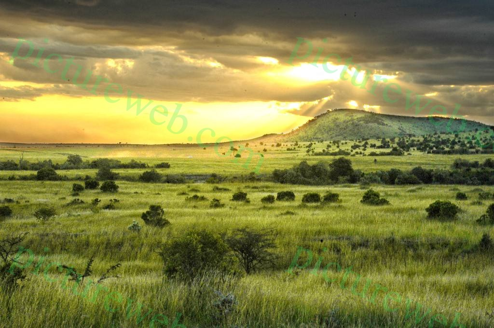
</div>

## 训练

本文模型在 `ModelScope` 提供的 `DSW-GPU` 实例上面训练, 包含一块约 22G 可用显存的 `A10` 显卡.

### 第一次训练

第一次训练使用输入大小为 `640x640` 的 `Yolo-v5-s` 预训练模型, 训练数据选择的是版本 1 无监督信息样本的 $99$ 张图片. 训练参数如下

参数名 | 参数详情
------ | ------
--img | 640
--weights | yolov5s.pt
--epochs | 100
--batch-szie | -1

由于分辨率过低检测框出现了较大偏移并对白色物体严重过拟合:

<div align="center">
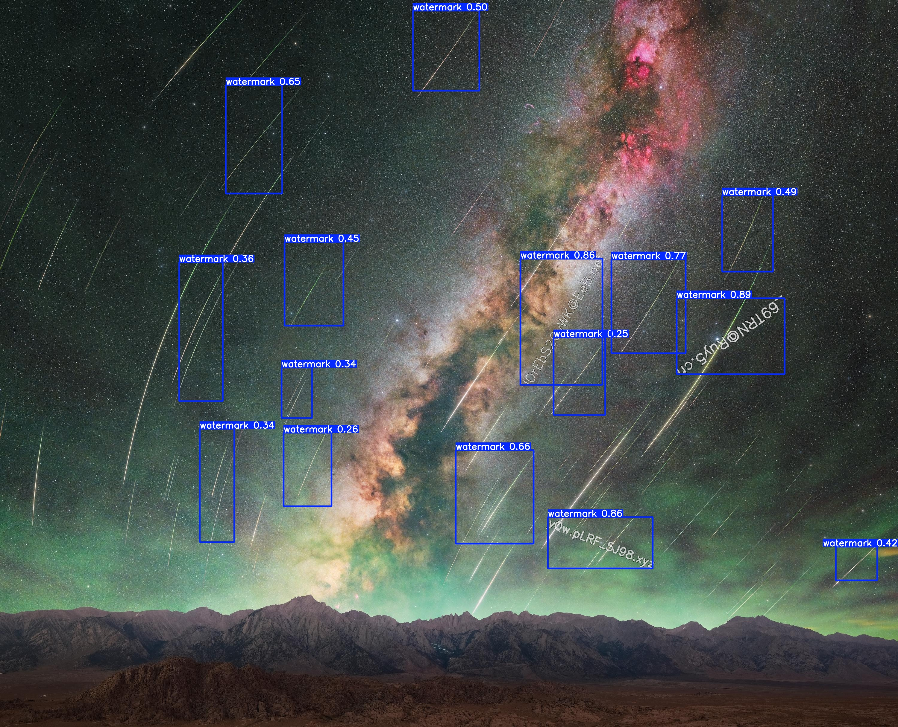
</div>

### 第二次训练

第二次训练使用输入大小为 `1280x1280` 的 `Yolo-v5-x6` 预训练模型, 训练数据选择的是版本 1 无监督信息样本的 $99$ 张图片. 训练参数如下 (epochs 为两次训练总和)

参数名 | 参数详情
------ | ------
--img | 1280
--weights | yolov5x6.pt
--epochs | 500
--batch-szie | -1

在 $200$ 轮左右时因损失无明显下降终止训练. 前 $100$ 轮的结果表现良好, 后 $100$ 轮的结果开始出现过拟合.

### 第三次训练

第三次训练使用输入大小为 `1280x1280` 的 `Yolo-v5-x6` 预训练模型, 训练数据选择的是版本 2 无监督游戏有监督信息混合样本的 $198+150=348$ 张图片. 训练参数如下

参数名 | 参数详情
------ | ------
--img | 1280
--weights | yolov5x6.pt
--epochs | 400
--batch-szie | -1

这次训练耗时 $6.3$ 小时. 在测试集运行样例如下:

<div align="center">
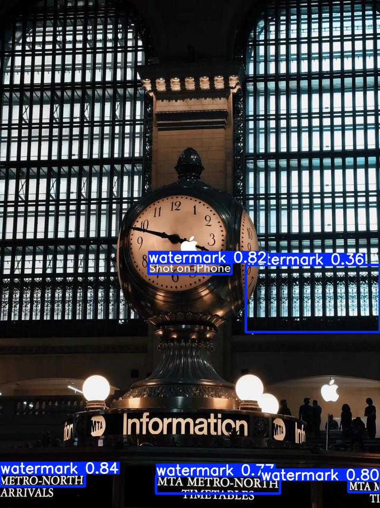
</div>

关于该训练的训练程序输出详情见附件中 `train_output.txt`. 最终模型详见附件中 `watermark_detection.pt`.

### 训练数据

#### 模型在训练数据上的表现

以下一系列数据图中蓝, 绿, 灰, 橙四条曲线分别代第一次训练, 第二次训练前半, 第二次训练后半, 第三次训练.

左右两幅图依次为 `obj_loss` 和 `box_loss`.

<div align="center">
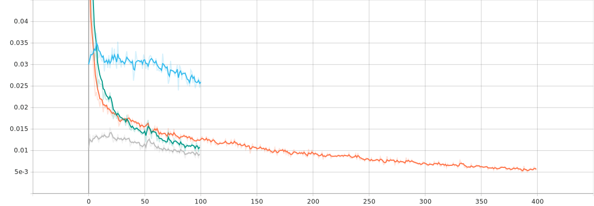
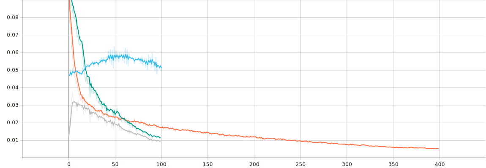
</div>

左右两幅图依次为 `precision` 和 `recall`.

<div align="center">
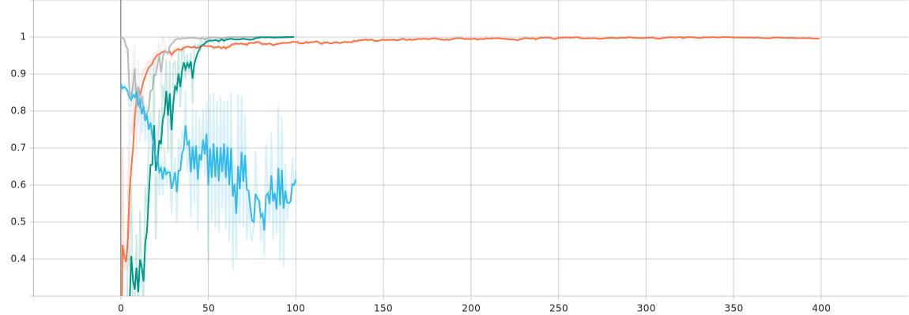
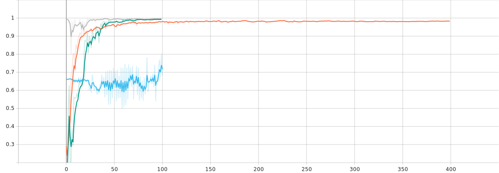
</div>

左右两幅图依次为 `mAP:0.5` 和 `mAP:0.5:0.95`.

<div align="center">
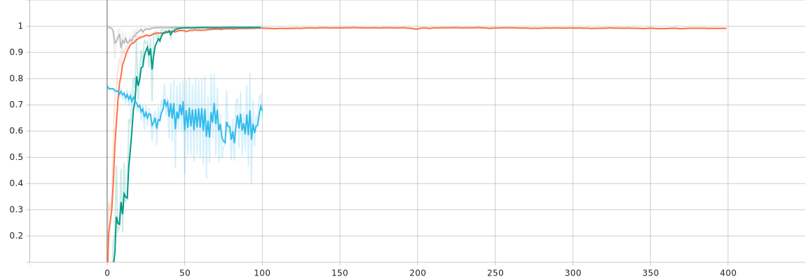
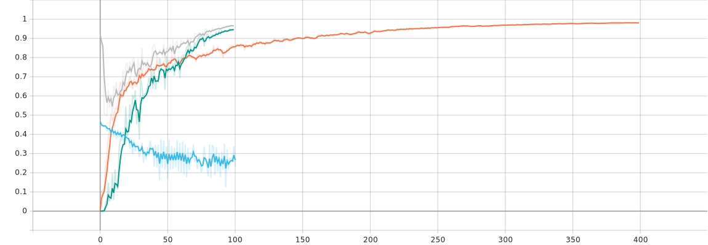
</div>

而最终模型和第二次训练完的模型在测试集 (全部为有监督样本) 上的表现为:

模型|Precision|Recall|mAP 50| mAP 50:95
----|----|---|---|---
第二次|0.557  |    0.482   |   0.418  |    0.235
最终|0.911     | 0.901  |    0.945  |     0.75

最终模型在测试数据上的表现

<div align="center">
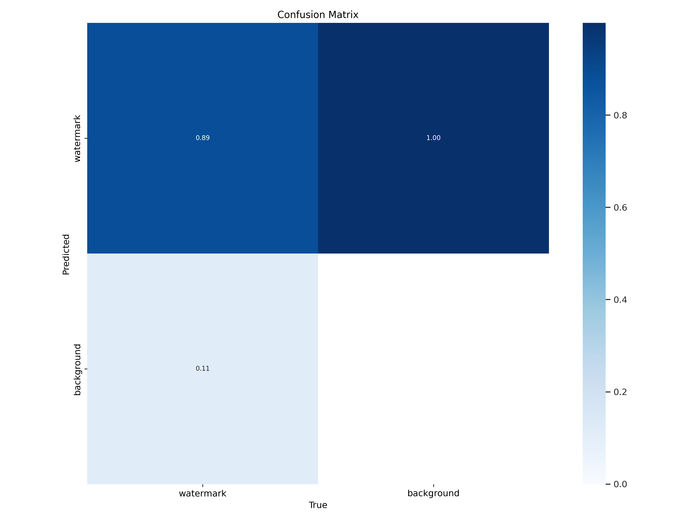
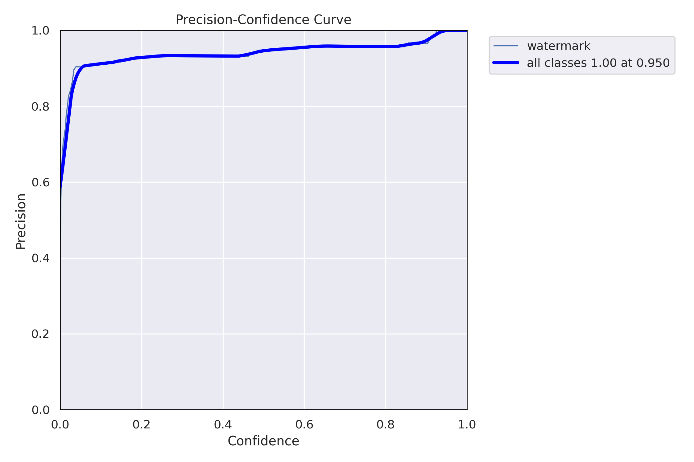
</div>
<div align="center">
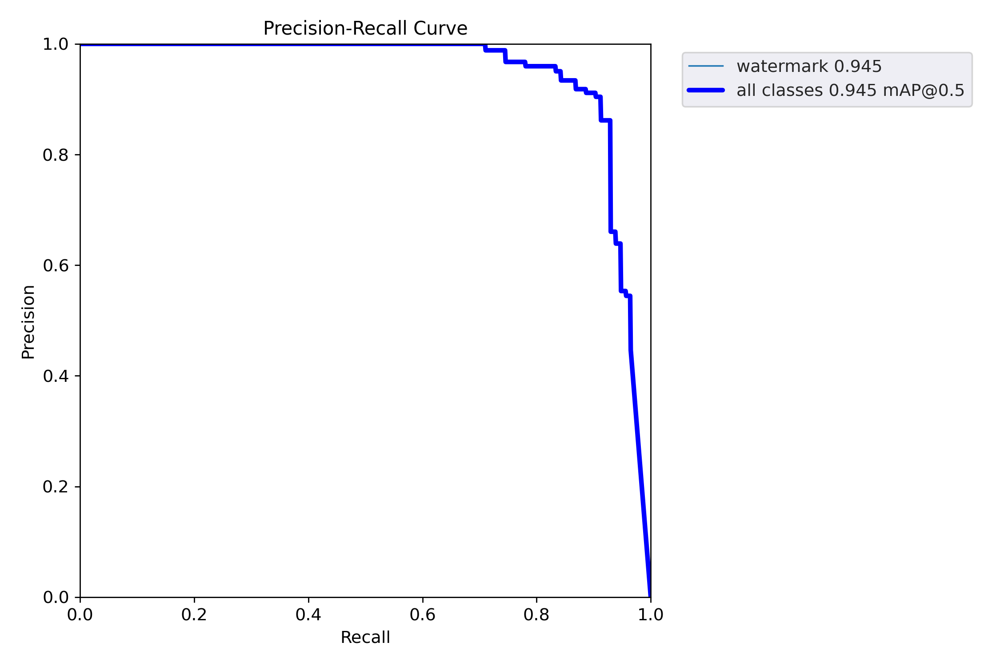
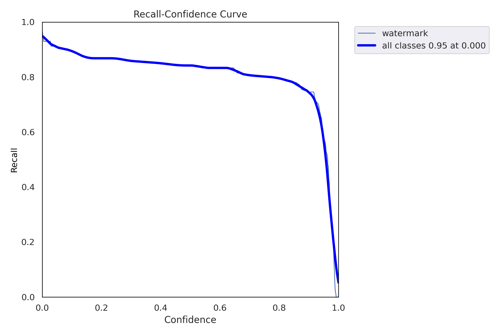
</div>

观察测试集上的表现可以发现, 模型在单个字符间隔较大的水印检测效果上比较差.

由于对于大部分风景视频, 其使用的是固定静态水印, 与静态图片并无较大差异, 故不作视频演示.

其它的检测样例详见附件中 `run_results` 文件夹.

## 总结与展望

&nbsp;&nbsp;&nbsp;&nbsp;&nbsp;&nbsp;&nbsp;&nbsp;本文实现的模型对文字较为紧凑的水印检测效果较好, 但对文字较为分散的水印检测效果较差. 下一步可以考虑改善数据生成器, 使生成样本涵盖范围尽可能扩大. 同时本模型覆盖训练样本中图片型水印较少, 下一步也可以将预训练完毕的扩散模型融入数据生成器, 使数据生成器生成一些符合逻辑且符合统计规律的水印图像.

## 注记

本小组成员包括: 肖子尧, 舒玉苗, 沈哲楷. 任务分配如下:

名字|任务
----|----
肖子尧|生成数据+训练+论文
舒玉苗|标注数据
沈哲楷|搜寻数据

## 附件

本文所有数据, 模型, 脚本均同步于 Github 仓库 [https://github.com/aixiaoyaowudi/deep_learning_course_team_project](https://github.com/aixiaoyaowudi/deep_learning_course_team_project). 文件组织结构详见仓库根目录下 `README.md`